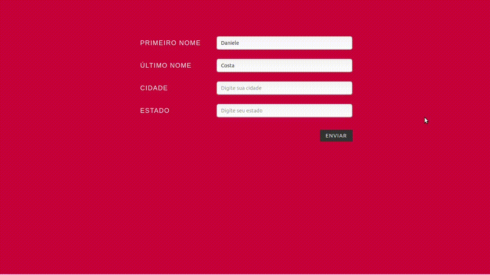

## Formulário com aplicação JavaScript

 Esse formulário faz parte de um dos exercícios do Curso de JavaScript do básico ao avançado (com TypeScript) na plataforma Udemy. 

[Deploy do Formulário](https://formulario-javascript.vercel.app/)

## Conteúdos básicos aplicados:

- array
- object
- function

